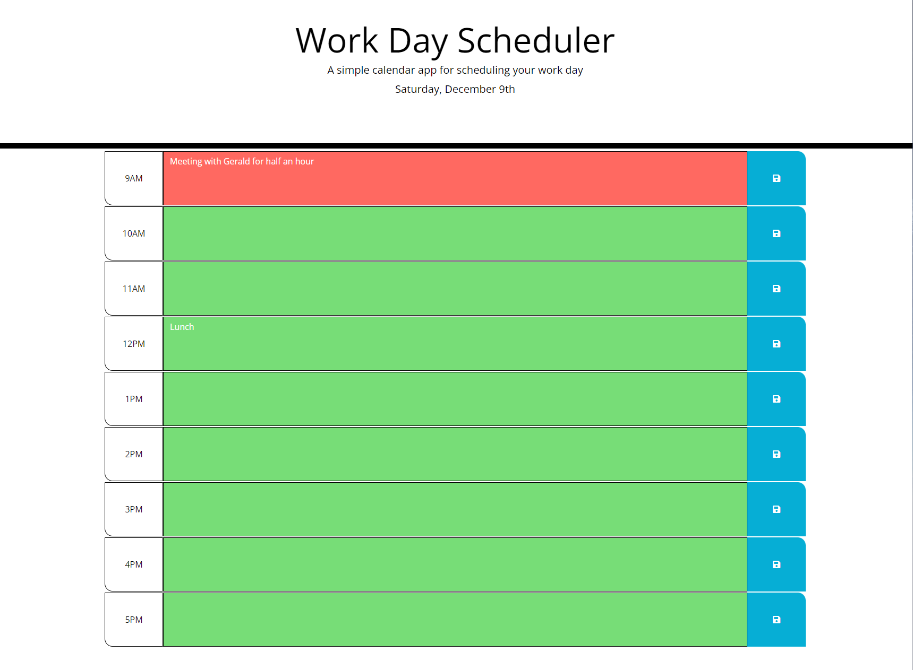

# Work-Day-Scheduler

## Description

My motivation for this project was to use HTML, CSS and JavaScript to create an application that will generate a random password based on criteria that is selected. This solves a problem of having to come up with a secure complex password yourself.

## Screenshot

## Installation

N/A

## Usage

This webpage can be used to create a random generated password between 8 and 128 characters with certain criteria's which are numeric, special, lowercase and uppercase characters. To use the random password generator you go onto the webpage, click generate password, you will then be asked a few different criteria's on which the password will be created using. Once all options have been selected a random password will be generated in the "Your secure password" box. 

## Link

https://mtlightfoot.github.io/work-day-scheduler/

## Credits

N/A

## License

Please refer to the LICENSE in the repo.